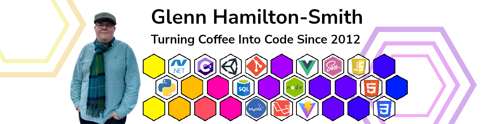
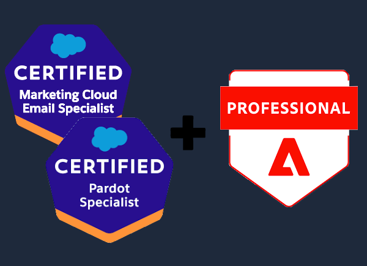
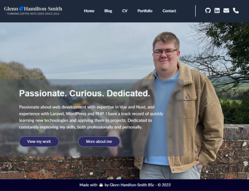

### `Hello World!`, and welcome to the coolest place on the internet 😎

Hey there 👋,

I'm Glenn! I make [websites](https://glennhs.co.uk) and [applications](https://github.com/GlennHS/AEtherSlay), mostly using **JavaScript, NodeJS, C# and Python!** I'm a curious programmer with a love of learning and a passion for improving. I'm always seeking out new challenges and love the sense of accomplishment from figuring out the solution to something tricky 💪

<h3 align="center"><b>Now Listening:</b></h3>

I can only apologise if the title to the above is... <i>interesting</i>. My music taste is varied to say the least!

----

<!-- 

  

 -->

<!-- TODO: Do something fancier with these cards -->

<table align="center">
  <tr>
    <td style="width:410px">
      
    </td>
    <td>
      

        I'm currently certified in three marketing automation platforms: **Marketo, Pardot (now Marketing Cloud Account Engagement) and Salesforce Marketing Cloud**, having achieved my certifications in Pardot and Marketo within 8 months of starting my role at [Clevertouch Marketing](https://clever-touch.com)! I specialise in web development and am continuously looking to improve my skills!
      

      

        I have been learning **Vue, Nuxt and Laravel** for over a year now and absolutely love them, they are definitely the biggest components of my personal stack! I have also been learning some **Unity C#** and hope to properly enter the [Ludum Dare](https://ldjam.com) contest properly one day!
      

    </td>
  </tr>
    <td>
      

        I've been working on my personal site, [GlennHS](https://glennhs.co.uk) for about a month now and its been a very fulfilling and enjoyable experience. I've been able to use new technologies, decide my own tech stack, learn about which technology works best for what, further my Nuxt and Vue learning as well as really get stuck in with TailwindCSS and Nuxt Content.
      

      

        I'm very proud of what I've accomplished so far and I really look forward to finding more fun side projects that I can add to my site as well as create more blog posts (read as: shout into this void we call the internet) :)
      

    </td>
    <td style="width:510px">
      
    </td>
  <tr>
  </tr>
</table>

----
<!-- You can't stop me from styling your READMEs GitHub, I've made emails for Outlook 2007 and 2016. I've seen hell -->

<table>
  <tr>
    <td width="500px" align="center">💻 Personal Site: <a href="https://glennhs.co.uk">https://glennhs.co.uk</a></td>
    <td width="500px" align="center">🔗 LinkedIn: <a href="https://www.linkedin.com/in/glennhs">https://www.linkedin.com/in/glennhs</a></td>
  </tr>
</table>

