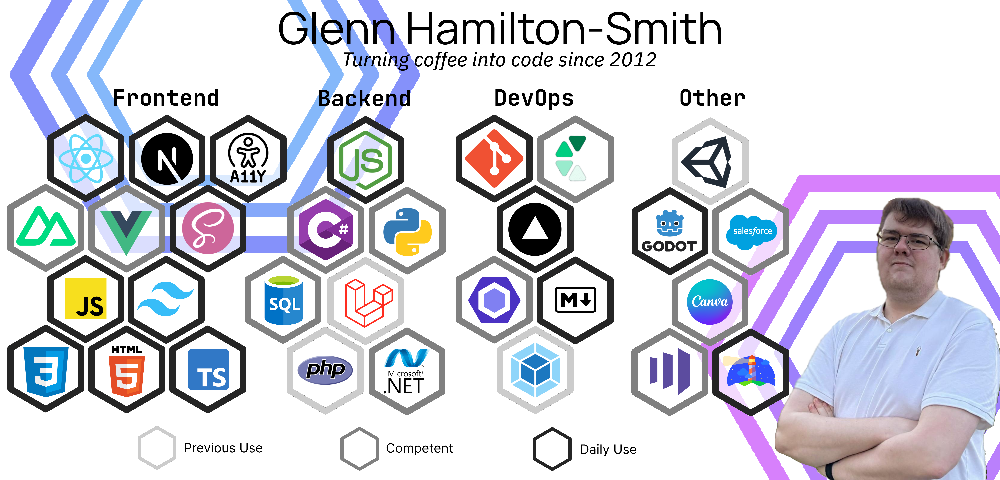

## Currently open to work! Please find my CV [here!](https://glennhs.co.uk/cv)

### `Hello World!`, welcome to where I call home!

Hey there 👋,

I'm Glenn! I'm a **South UK-based front-end web developer** who makes **[websites](https://glennhs.co.uk)** and **[applications](https://github.com/GlennHS/AEtherSlay)**! I'm a curious programmer with a love of learning and a passion for improving. I'm always seeking out new challenges and love the sense of accomplishment from figuring out the solution to something tricky 💪

<!--<h3 align="center"><b>Now Listening:</b></h3>

I can only apologise if the title to the above is... <i>interesting</i>. My music taste is varied to say the least!
-->

----

<!-- 

  

 -->

### 💜 Favourite Repositories
 
 
 

### 🔭 Current Focus
- Building a voice-controlled smart home system using Raspberry Pi + Python
- Jobhunting for my next career step
- Refining my personal portfolio [glennhs.co.uk](https://glennhs.co.uk)

### 🛠 Tech I Use Regularly

**Languages:** JavaScript, TypeScript, HTML, CSS

**Frameworks:** React, Next.JS Vue 3, Nuxt 3, Node.js

**Styling:** TailwindCSS, SCSS

**Tooling:** ESLint, React Testing Library, Docker, Terraform, Git, Vercel

**Other:** Raspberry Pi, Python, C#, Godot, Web Performance/Lighthouse, Accessibility (WCAG)

👉 Full CV at [glennhs.co.uk/cv](https://glennhs.co.uk/cv)

### ✍️ Recent Blog Posts

🛠 Coming Soon!

### 📬 Reach Me

- 🌐 Site: [glennhs.co.uk](https://glennhs.co.uk/contact)
- 💼 LinkedIn: [linkedin.com/in/glennhs](https://www.linkedin.com/in/glennhs)
- 📫 Email: Found on my [CV](https://glennhs.co.uk/cv)

----
<!-- You can't stop me from styling your READMEs GitHub, I've made emails for Outlook 2007 and 2016. I've seen hell -->

<table>
  <tr>
    <td width="500px" align="center">💻 Personal Site: <a href="https://glennhs.co.uk">https://glennhs.co.uk</a></td>
    <td width="500px" align="center">🔗 LinkedIn: <a href="https://www.linkedin.com/in/glennhs">https://www.linkedin.com/in/glennhs</a></td>
  </tr>
</table>

